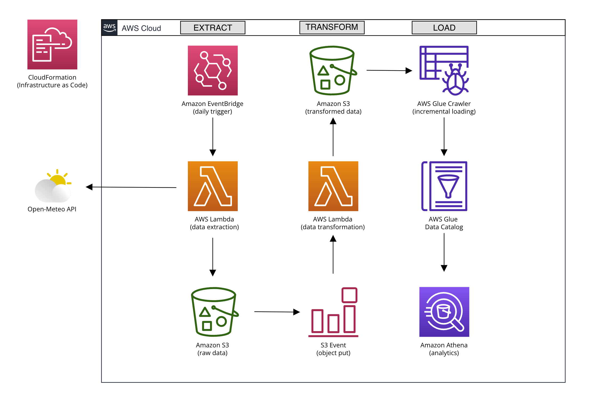
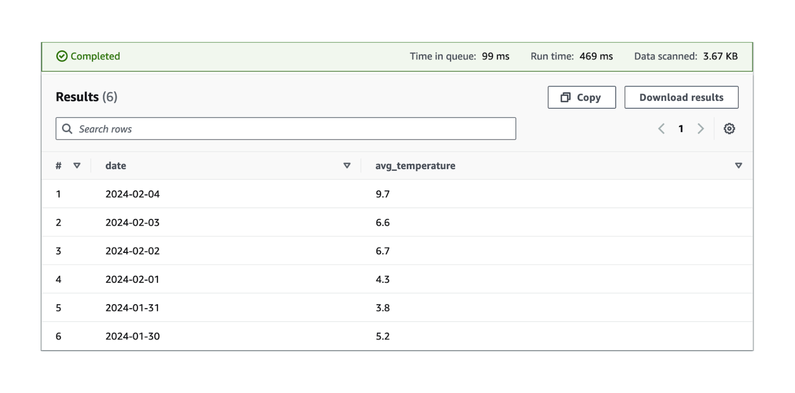
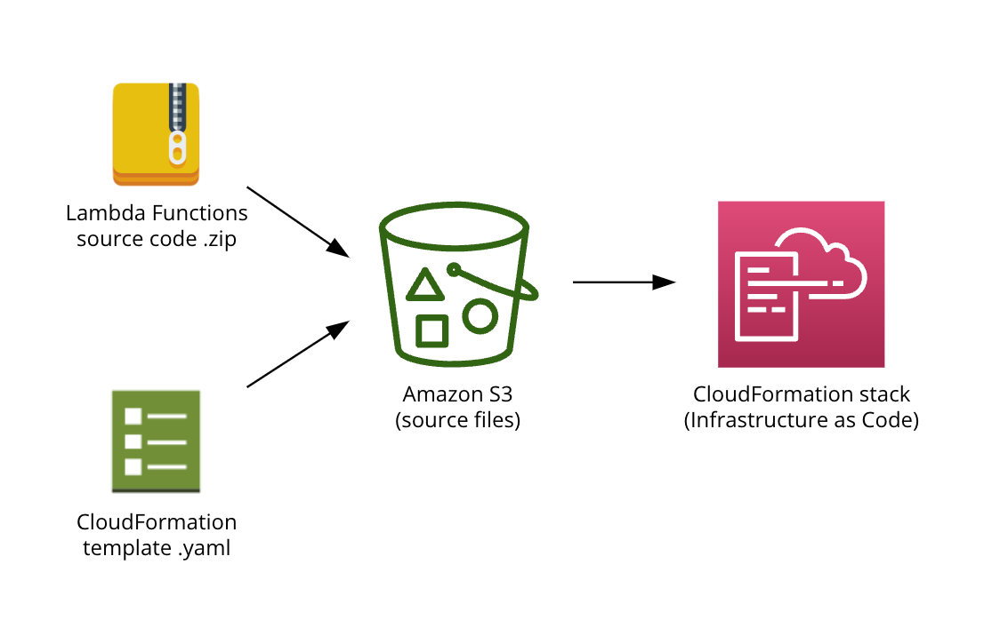
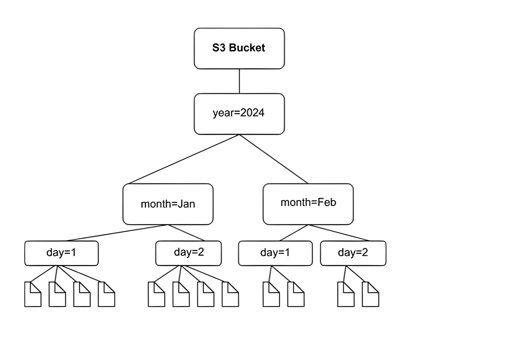
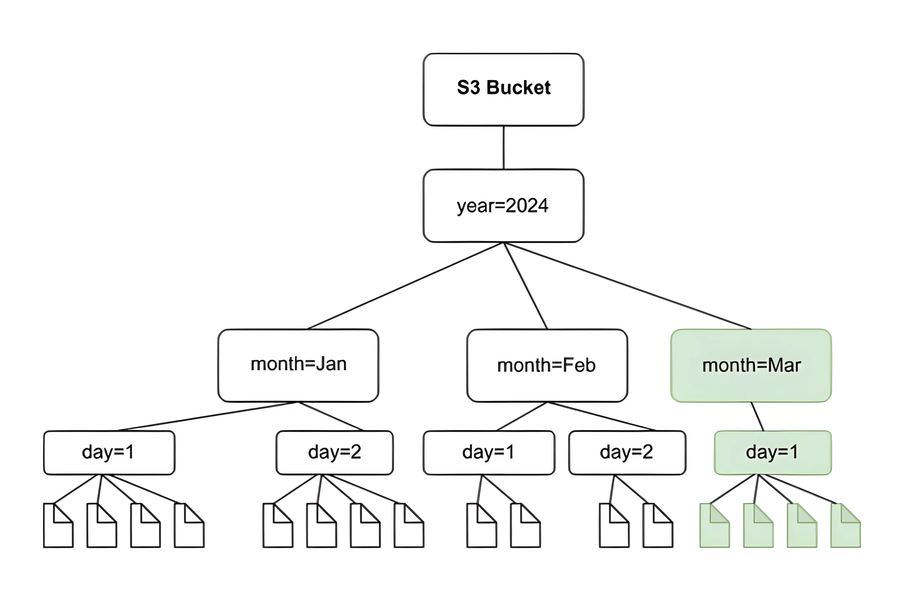

# AWS DAILY INCREMENTAL ETL

[//]: # (Lambda)

[//]: # (Glue)

[//]: # (S3)

[//]: # (Athena)

[//]: # (Cloudformation)

[//]: # (Python)

[//]: # (EventBridge)

[//]: # (S3 Partitions)

[//]: # (S3 Events)

This project automates the daily incremental extraction, transformation, and loading (ETL) of meteo data from the Open-Meteo API using AWS services. Leveraging AWS Lambda, Amazon S3, AWS Glue, Amazon Athena, and AWS CloudFormation it establishes an easily scalable data pipeline. The first Lambda function uploads raw JSON data that is retrieved from the API to a raw data S3 Bucket and is triggered daily via EventBridge. The second Lambda function transforms the new data into clean CSV format, uploads them in the transformed data S3 Bucket, and is triggered by S3 put events of the raw data S3 Bucket. Additionally, after the successful data transformation, this Lambda function programmatically invokes the Glue crawler which performs incremental loads into the Glue Data Catalog, crawling only the new partition folders. Amazon Athena is utilized to analyze the data, querying the overall table in the Glue Data Catalog. The specified architecture is configured in a CloudFormation template providing a reliable, reproducible, and version-able deployment mechanism that can be applied to different regions or accounts. This solution offers a cost-effective and highly scalable approach for daily incremental ETL, facilitating extensive analysis and insights derivation.

## Analysis

The integration of the AWS Glue Data Catalog with Amazon S3 and Amazon Athena forms a robust foundation for efficient data management and analysis. By leveraging the Glue Data Catalog, which contains metadata information about table schemas populated by Glue crawlers, you can seamlessly query data in Athena directly from S3. Furthermore, the implementation of partitions within S3 enhances query performance by reducing the amount of scanned data, thereby optimizing query execution speed and cost. In this specific project, an example is provided that aggregates hourly timestamp data obtained from the Open-Meteo API into daily summaries, such as finding the average temperature for each date, so you can easily compare temperature trends over time. This is just one example of the numerous analyses that can be performed, showcasing the versatility and power of integrated AWS services in extracting valuable insights from cost-effective data stored on S3.

## Instructions

To create the AWS CloudFormation stack, follow these steps:

1. Create an Amazon S3 bucket in the same AWS Region where you plan to create the CloudFormation stack and populate it with the Lambda Functions zip and CloudFormation YAML template.
2. Create a new IAM role specifically for the CloudFormation service that grants the necessary permissions to create all the resources defined in your CloudFormation template.
3. When creating the CloudFormation stack fill in the SourceCodeBucket parameter with the S3 bucket name (e.g. my-code-bucket-123) of the one you previously created and uploaded the source files.

## Partitions

When AWS Glue's crawler scans Amazon S3 and identifies multiple folders within a bucket, it establishes the root of a table within the folder structure and identifies which folders serve as partitions for the table. The table's name is derived from the Amazon S3 prefix or folder name. By providing an Include path pointing to the folder level to be crawled, you guide the crawler's behavior. When the schemas across most folders at a particular level are similar, the crawler consolidates partitions into a single table instead of creating separate tables.

Partitioning in Amazon S3 offers several benefits for query optimization and incremental crawling. Firstly, it allows for more efficient query processing by restricting the scope of data scanned based on the partition key, thereby reducing query execution time and cost. In Athena queries, partitioning enables faster query execution by leveraging partition pruning, which skips irrelevant partitions based on the query predicates, resulting in quicker data retrieval and improved query performance. Secondly, during incremental crawling, partitioning enables the crawler to identify and process only the newly added or modified data partitions, enhancing the efficiency of data ingestion and minimizing unnecessary processing.

## Incremental Crawling

When you schedule a crawler to discover data in Amazon S3, you can choose to crawl all folders or crawl new folders only. In the first mode, every time the crawler runs, it scans data in every folder under the root path it was configured to crawl. This can be slow for large tables because, on every run, the crawler must list all objects and then compare metadata to identify new objects. In the second mode, commonly referred as incremental crawling, every time the crawler runs, it processes only S3 folders that were added since the last crawl. Incremental crawls can reduce runtime and cost when used with datasets that append new objects with consistent schema on a regular basis.

